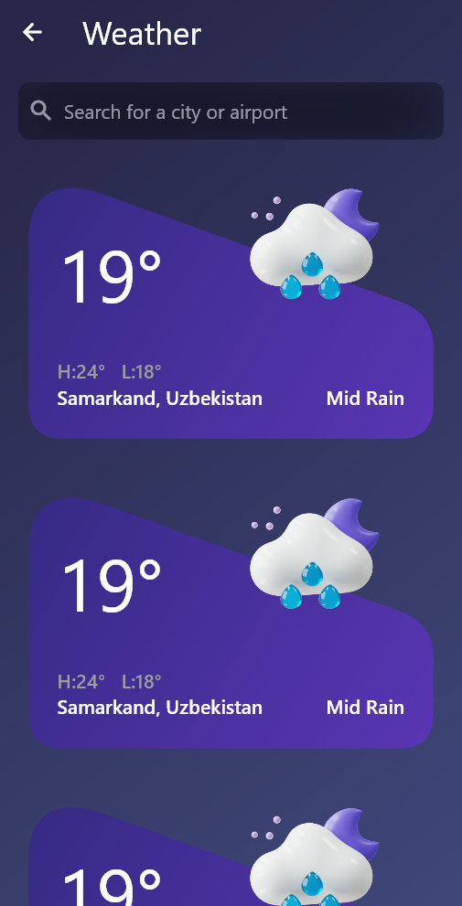

# weather_app

A new Flutter project.

## Description

This is a weather app that uses the Visual Crossing weather API to get the weather data for a given city. The app uses the `flutter_provider` to manage the state of the app. The app also uses the http package to make the API calls. 
I have also used custom_pain widget to draw shapes that cannot be drawn using the default widgets.

## Screenshots

  
  
  

## Getting Started

This project is a starting point for a Flutter application.

A few resources to get you started if this is your first Flutter project:

- [Lab: Write your first Flutter app](https://docs.flutter.dev/get-started/codelab)
- [Cookbook: Useful Flutter samples](https://docs.flutter.dev/cookbook)

For help getting started with Flutter development, view the
[online documentation](https://docs.flutter.dev/), which offers tutorials,
samples, guidance on mobile development, and a full API reference.
